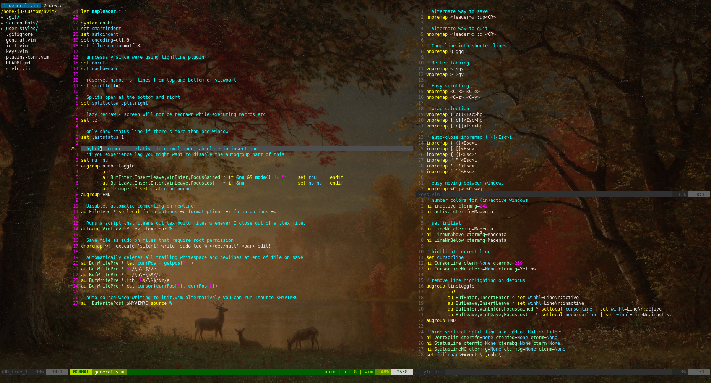

# Lightweight & Transparent Neovim config

## About

These are my configuration files for neovim. I like to keep it lightweight, so
there are only a few small essential plugins. The config files aren't long and
are commented, so you can read through them yourself and understand what
they're doing.

Inside the user-styles repository is a color config for the Lightline plugin,
which allows for transparent tab line and more colorful status bar in normal
mode.

## How to use

1) Install neovim and [Plug](https://github.com/junegunn/vim-plug).
2) copy `init.vim`, `keys.vim` and `style.vim` into your `.config/nvim`
3) use `:PlugInstall` to install all the necessarry plugins
4) copy `user-styles/powerline_transparent.vim` into `~/.config/nvim/plugged/lightline.vim/autoload/lightline/colorscheme`
